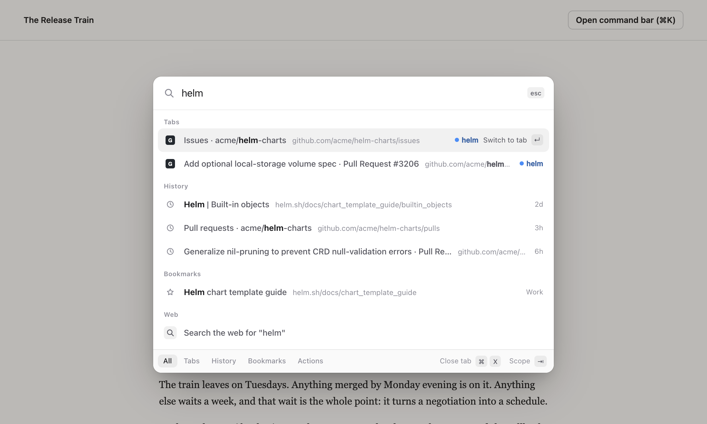
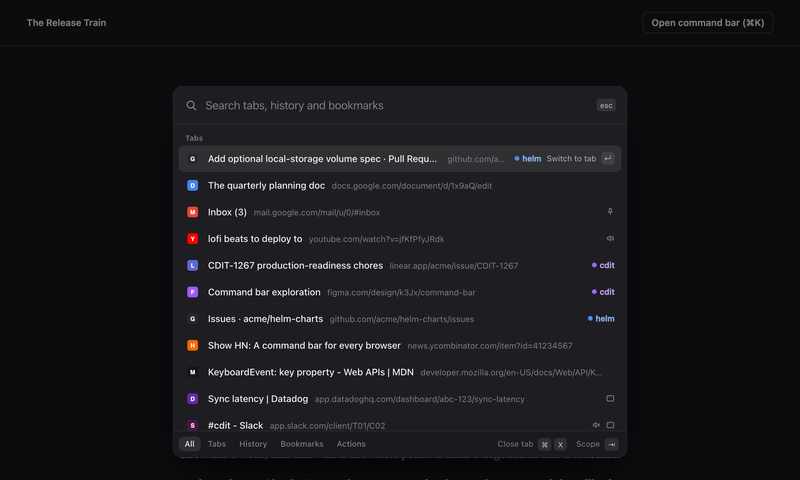

# command k

a command bar for chrome, brave and other chromium browsers. press `cmd+k` to switch tabs, search history and bookmarks, and run tab actions from the keyboard. the idea comes from arc's command bar.





## install

it isn't on the chrome web store, so load it unpacked.

1. `git clone https://github.com/varunkvv/command_k_chrome_extension.git`
2. open `chrome://extensions` (`brave://extensions` in brave) and turn on developer mode
3. click "load unpacked" and pick the cloned folder

the shortcut is `cmd+k` on mac and `ctrl+k` everywhere else. if another extension already has it the browser leaves it unset, and on windows / linux `ctrl+k` is also chrome's own search shortcut. either way you can set it at `chrome://extensions/shortcuts`.

tabs that were open before you installed it work right away, no reload needed. clicking the toolbar icon does the same thing as the shortcut.

try it on a regular page first. `chrome://extensions`, where you just were, is one of the pages where it can't draw the centered bar (see limits).

## features

- switch to any open tab in any window. tabs are listed most recently used first, so `cmd+k` then `enter` goes back to the last tab
- fuzzy search over tab titles and urls, history and bookmarks. `gpr` finds "GitHub Pull Requests"
- reopen recently closed tabs and windows
- tab group, pinned, audio and other-window markers on each tab
- around 30 actions: new / duplicate / pin / mute / reload / close tabs, close duplicates, close tabs to the right, sort or group tabs by site, merge windows, suspend background tabs, copy the url or a markdown link, bookmark the page, jump to history / downloads / extensions / settings
- type a url to open it, or anything else to search with your default search engine
- results you pick often float up
- light and dark, following the system. the "switch theme" action overrides it

## keys

| key | does |
| --- | --- |
| `cmd+k` / `ctrl+k` | open or close the bar |
| `up` `down`, or `ctrl+n` `ctrl+p` on mac | move |
| `enter` | switch to the tab, or open the result in a new tab |
| `cmd+enter` / `ctrl+enter` | open in the current tab |
| `shift+enter` | open in a new window |
| `tab` / `shift+tab` | cycle scope: all, tabs, history, bookmarks, actions |
| `>` | jump to actions |
| `cmd+x` / `ctrl+x` | close the selected tab and keep the bar open |
| `cmd+c` / `ctrl+c` | copy the selected url |
| `esc` | close |

if the url you pick is already open, `enter` switches to that tab instead of opening a second copy.

## permissions

| permission | why |
| --- | --- |
| `activeTab`, `scripting` | show the bar on the page you're on when you press the shortcut. there is no `<all_urls>` access and nothing runs on a page until you open the bar there |
| `tabs`, `tabGroups` | list, switch, close and group tabs |
| `history`, `bookmarks`, `sessions` | search them, and reopen closed tabs |
| `favicon` | icons from the browser's local favicon cache |
| `search` | hand a query to your default search engine |
| `storage` | theme, and how often you've picked a result |
| `clipboardWrite` | the copy url actions |

nothing leaves your machine. there are no network requests, no analytics and no remote code.

in incognito (if you allow it there) the bar only sees incognito tabs, and nothing you pick is written to storage.

## how it works

`background.js` listens for the shortcut and injects `content.js` into the active tab. the content script adds one element in the top layer holding an iframe that points at `palette.html`.

the iframe is an extension page, which is why it's built this way. page css can't restyle it, a strict content security policy can't block it, and page key handlers never see what you type. it also means the same page works as the toolbar popup.

ranking is in `src/search.js` and `src/fuzzy.js`. both are plain functions with no browser dependencies.

## development

there is no build step and no dependencies.

```bash
npm test
```

runs the unit tests for matching and ranking (node 20.11+).

```bash
npm run dev
```

serves the repo on http://127.0.0.1:4173. open `/dev/page.html` to try the bar against fake tabs and history without loading the extension. `?theme=dark` and `?q=helm` are there for screenshots.

```bash
CHROME_BIN=/path/to/chromium npm run e2e
```

loads the real extension in headless chrome and checks the overlay, search, tab switching, a strict csp page and the popup fallback. it needs chrome for testing or chromium, because branded chrome ignores `--load-extension`.

after editing, hit reload on the extension card in `chrome://extensions`.

## limits

- browsers don't let extensions draw on `chrome://` pages, the new tab page or the web store. there the same bar opens as a popup under the toolbar icon. chrome decides that popup's position and shape, so it can't be centered or rounded
- firefox and safari aren't supported. it uses chromium-only apis (`tabGroups`, `sessions`, `_favicon`)
- history search covers the 2,500 most recent pages with fuzzy matching, and falls back to the browser's own word matching for older ones

## license

MIT
